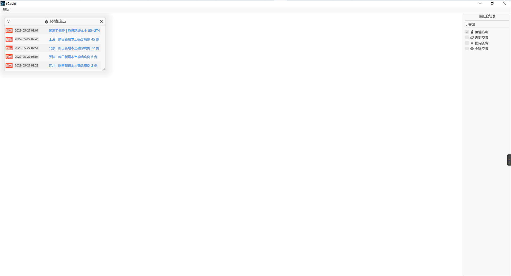
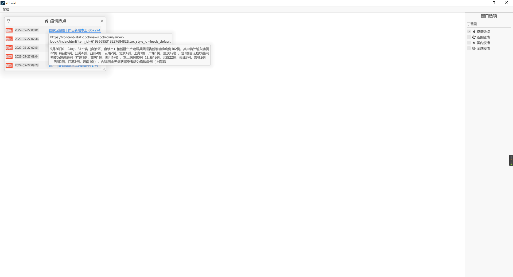
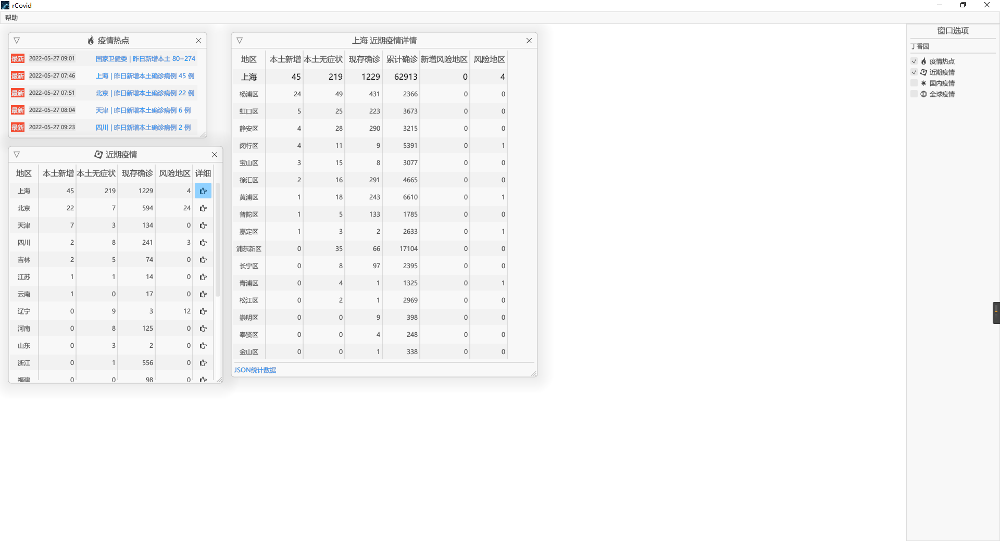
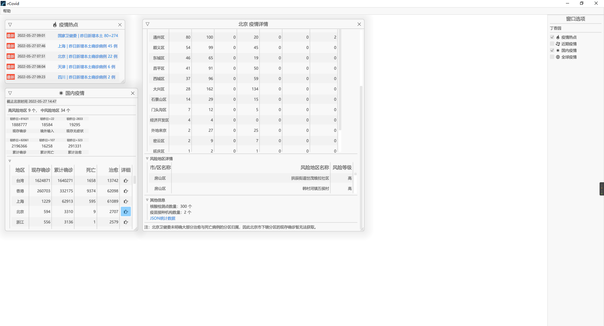
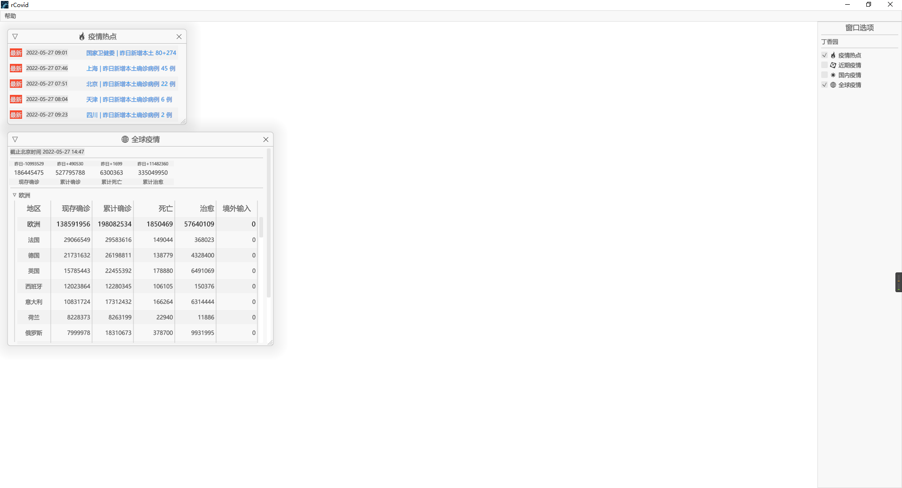

## 项目介绍

`rCovid`由`Rust`和`egui`构建的展示2019新型冠状病毒（COVID-19/2019-nCoV）实时疫情的应用，数据来源为[丁香园](https://ncov.dxy.cn/ncovh5/view/pneumonia) 。

[Rust](https://en.wikipedia.org/wiki/Rust_(programming_language)) 是由Mozilla主导开发的通用、编译型编程语言。设计准则为“安全、并发、实用”，支持函数式、并发式、过程式以及面向对象的程序设计风格。AWS、Google、微软、华为都是Rust基金会成员。

[egui](https://github.com/emilk/egui) 是一个使用Rust构建的易于上手的即时模式的GUI框架。

结合国内当前疫情情况以及正在学习的`Rust`，巩固学习的知识，个人爱好，如有谬误请指正。

## 截图

## 运行
1. 安装Rust

    进入[Rust官网](https://www.rust-lang.org/) ，并根据操作系统下载安装`Rust`.
2. 克隆项目
    
    `git clone https://github.com/GISerliang/r_covid.git`
3. 项目编译运行

    打开终端（cmd、powershell、bash等），进入`r_covid`目录，执行`cargo build --release && cargo run --release`。

## TODO
- [x] 丁香园实时数据
- [ ] WHO数据
- [ ] 历史数据
- [x] 表格展示
- [ ] 图表展示
- [ ] 各平台打包脚本
- [ ] Web编译

## 更新日志

- V0.1.0
  - 获取丁香园实时数据
  - 增加疫情热点
  - 增加近期疫情（各省详细信息）
  - 增加国内疫情（各省详细信息）
  - 增加全球疫情（各国详细信息）